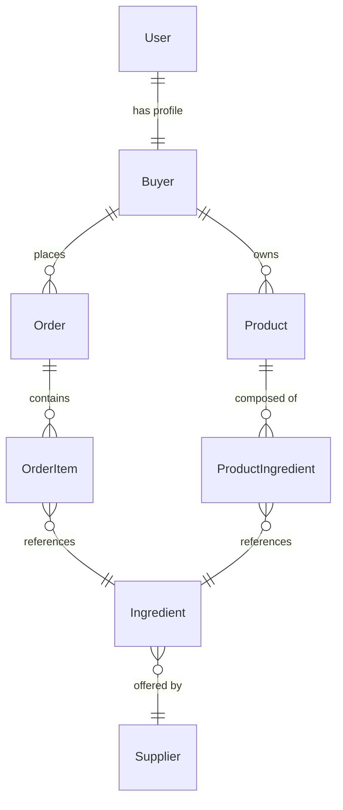
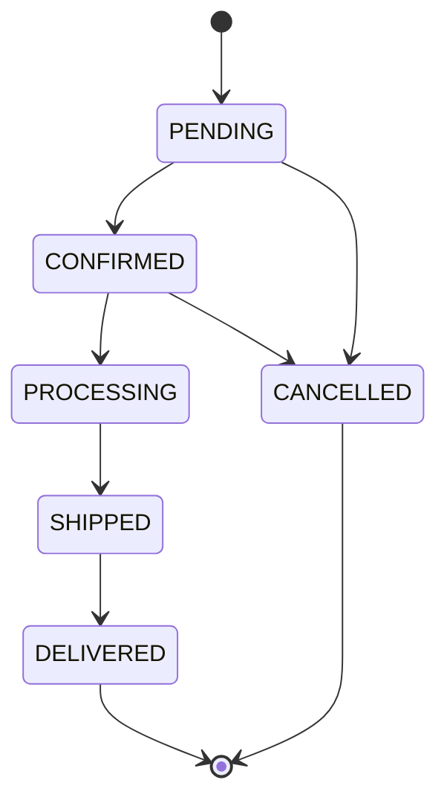

# Opply Platform Engineering Challenge — Template

This repository is the starter template for the **Platform squad** technical interview at Opply. The specific challenge is revealed at the start of the 90-minute session. Before then, your job is to get the stack running and configure your AI tooling.

---

## What's in the box

- **Django + DRF backend** exposing Opply's core domain (buyers, suppliers, ingredients, orders, order items, products). SQLite-backed for ease of setup.
- **LocalStack** with Step Functions, Lambda, SQS, SNS, IAM, CloudWatch Logs, EventBridge, S3, Secrets Manager, DynamoDB, CloudFormation, SSM, ECR, and STS enabled.
- **`supplier-mock` service** — a Flask app at `http://supplier-mock:8080` that stands in for the external supplier. Accepts notifications, pushes lifecycle callbacks, and exposes a status endpoint for polling. See [Supplier mock contract](#supplier-mock-contract) below.
- **CDK Python scaffold** in `infra/` with a single hello-world Lambda so you can verify the deploy loop end-to-end.
- **Makefile** orchestrating the common commands (`make up`, `make deploy`, `make destroy`, `make seed`, `make logs`).

No frontend — interact with the backend via `curl` or the Django admin.

---

## Domain model



### Order state machine



### Product team → platform team handoff

When an order transitions from `CONFIRMED → PROCESSING`, the Django view calls:

```python
# backend/orders/services.py
def publish_order_transitioned(order, previous_status: str) -> None:
    ...  # empty — this is where you start
```

**That function is empty.** How the event leaves Django, how it's delivered, and what runs the downstream workflow is entirely your design. Fill in the body, change the call site, or rework the integration — whatever fits the challenge brief you'll receive.

---

## Supplier mock contract

The `supplier-mock` service simulates the external supplier. It's reachable from inside the docker network at `http://supplier-mock:8080` (and from your host at `http://localhost:8080`).

### Endpoints

**`POST /notify`** — tell the supplier about an order.

Request body (JSON):
```json
{
  "order_id": 42,
  "callback_url": "http://…/supplier-callback",
  "items": [...]
}
```

- `order_id` (required): any identifier for the order.
- `callback_url` (optional): URL the mock will POST lifecycle events to. If omitted, callbacks are skipped — use `GET /status/<order_id>` to poll instead.
- Any other fields are ignored but logged.

Responses:
- `202 { "status": "accepted", "order_id": … }` — happy path
- `500 { "error": "simulated supplier outage" }` — when the configured fail rate fires
- `400 { "error": "order_id is required" }` — missing order_id

**`GET /status/<order_id>`** — pull-model alternative to callbacks.

Returns `{ "order_id": …, "state": "unknown" | "accepted" | "confirmed" | "shipped" | "delivered" }`.

**`GET /healthz`** — health check.

### Lifecycle callbacks

After a successful `/notify`, the mock sends three POSTs to `callback_url` (if supplied), each with body `{ "event": "<name>", "order_id": <id> }`:

| Event | Default delay from `/notify` |
|---|---|
| `confirmed` | ~5 s |
| `shipped` | +10 s |
| `delivered` | +15 s |

Callbacks are fire-and-forget (mock logs the result; it doesn't retry).

### Configuration (env vars in `docker-compose.yml`)

| Variable | Default | Effect |
|---|---|---|
| `SUPPLIER_FAIL_RATE` | `0.0` | Probability (0–1) that `/notify` returns 500 |
| `SUPPLIER_LATENCY_MS` | `0` | Artificial latency added before every `/notify` response |
| `SUPPLIER_CONFIRMED_DELAY_S` | `5` | Delay before `confirmed` callback |
| `SUPPLIER_SHIPPED_DELAY_S` | `10` | Further delay before `shipped` callback |
| `SUPPLIER_DELIVERED_DELAY_S` | `15` | Further delay before `delivered` callback |

Crank `SUPPLIER_FAIL_RATE` or `SUPPLIER_LATENCY_MS` to stress-test your retry / timeout behaviour.

---

## Prerequisites

- **Docker** + **Docker Compose**
- **Node 20+** with `npm`
- **[uv](https://github.com/astral-sh/uv)** — `brew install uv` on macOS, or see [install docs](https://docs.astral.sh/uv/getting-started/installation/)
- **AWS CLI** — `brew install awscli` on macOS

You'll install one global npm package (`aws-cdk` + `aws-cdk-local`) in step 3.
uv will install Python 3.11 for you automatically if you don't already have it.

---

## Setup

**1. Clone and enter the directory**

```bash
git clone <your-fork-url> platform-interview-template
cd platform-interview-template
cp backend/.env.example backend/.env
```

**2. Start services**

```bash
make up
```

Starts the Django backend and LocalStack. Wait ~15 seconds for LocalStack to finish starting.

**3. Install CDK + CDK-local CLI**

```bash
npm install -g aws-cdk@2.160.0 aws-cdk-local@2.18.0
```

**4. Create a Python venv for the CDK project**

```bash
cd infra
uv venv --python 3.11
uv pip install -r requirements.txt
cd ..
```

No activation step needed — `cdk.json` is wired with `uv run python app.py` so the Makefile `deploy` / `destroy` / etc. resolve the venv automatically.

**5. Bootstrap CDK (once) + deploy hello-world**

```bash
make bootstrap
make deploy
```

Expected output: `✅  HelloWorldStack`.

**6. Verify end-to-end**

```bash
export AWS_ACCESS_KEY_ID=test AWS_SECRET_ACCESS_KEY=test AWS_DEFAULT_REGION=eu-west-2
aws --endpoint-url=http://localhost:4566 lambda invoke \
  --function-name hello-world /tmp/invoke-out.json
cat /tmp/invoke-out.json
```

Expected: `{"statusCode": 200, "body": "{\"hello\": \"world\", \"received\": {}}"}`.

**7. Seed the backend**

```bash
make seed
```

---

## Before the session

Complete **both** of these in addition to the setup above:

### Configure your AI coding assistant

Set up whichever tool you use (Claude Code, Cursor, Aider, etc.) so it can work effectively in this codebase. That likely means:

- A `CLAUDE.md` / `.cursorrules` / equivalent explaining the domain and conventions
- Any custom skills, slash commands, or prompts that help you work here
- Tool permissions / allowed commands so the assistant doesn't stall on prompts

### Add quality guardrails

Add whatever quality tooling you consider appropriate. Possibilities:

- Linters (ruff, flake8)
- Type-checker (mypy, pyright)
- Pre-commit hooks
- IaC static analysis (cdk-nag, checkov)
- Whatever else you believe a project like this should have

---

## Don't pre-implement

The specific challenge drops at the start of the session. Think about the problem space — that's natural — but don't build any features or infrastructure beyond the hello-world baseline.

---

## Demo credentials

| Field | Value |
|---|---|
| Username | `demo` |
| Password | `demo1234` |

Use these to obtain a token:

```bash
curl -X POST http://localhost:8000/api/auth/login/ \
  -H "Content-Type: application/json" \
  -d '{"username":"demo","password":"demo1234"}'
```

Django admin: `http://localhost:8000/admin/` (same credentials).

---

## API endpoints

| Method | Path | Auth | Description |
|---|---|---|---|
| POST | `/api/auth/login/` | No | Obtain auth token |
| GET | `/api/buyers/me/` | Token | Current buyer profile |
| GET | `/api/suppliers/` | Token | List all suppliers |
| GET | `/api/suppliers/<id>/` | Token | Supplier detail |
| GET | `/api/suppliers/<id>/ingredients/` | Token | Ingredients for a supplier |
| GET | `/api/ingredients/` | Token | All ingredients |
| GET, POST | `/api/orders/` | Token | List / create orders |
| GET | `/api/orders/<id>/` | Token | Order detail with items |
| POST | `/api/orders/<id>/transition/` | Token | Advance order state (calls `publish_order_transitioned()` on CONFIRMED→PROCESSING) |
| GET, POST | `/api/products/` | Token | List / create products |
| GET, PATCH, PUT, DELETE | `/api/products/<id>/` | Token | Product detail, update, delete |

All authenticated endpoints require the header `Authorization: Token <token>`.

---

## Useful commands

| Command | What it does |
|---|---|
| `make up` | Start backend + LocalStack |
| `make down` | Stop everything, remove volumes |
| `make logs` | Tail backend + LocalStack logs |
| `make seed` | Migrate + re-seed fixtures |
| `make bootstrap` | CDK bootstrap LocalStack (run once per env) |
| `make deploy` | CDK deploy all stacks |
| `make destroy` | CDK destroy all stacks |
| `make synth` | Generate CloudFormation without deploying |
| `make diff` | Show CDK diff vs LocalStack |
| `make clean` | Remove CDK artefacts |

---

## Troubleshooting

**LocalStack health check fails / CDK bootstrap fails**
Give it another 10-20 seconds. The container can be slow to start on cold docker.

**`aws` commands hang**
Check you're passing `--endpoint-url=http://localhost:4566`. Without it, the CLI tries to reach the real AWS.

**CDK complains about credentials**
Make sure `AWS_ACCESS_KEY_ID=test`, `AWS_SECRET_ACCESS_KEY=test` are exported in your shell when running `cdklocal` — the `make` targets export them for you.

**Node version warnings**
Use Node 20 or newer.

---

## We're looking forward to the session.
